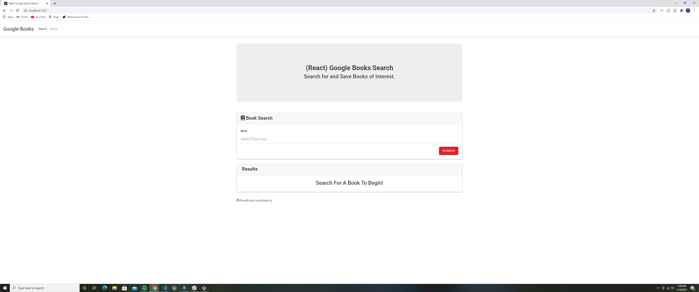
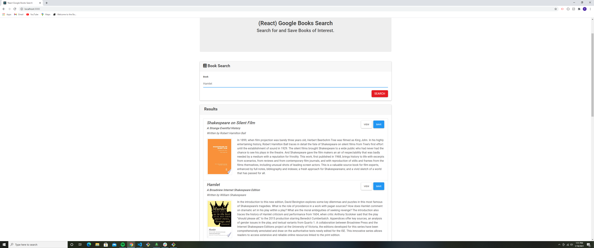
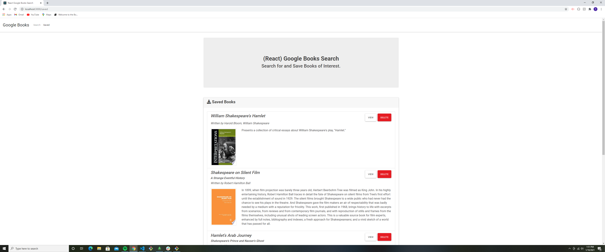
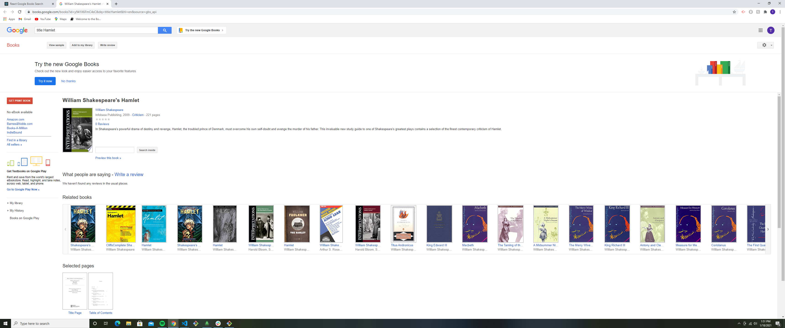

# GoogleBook

## Motivation

* The motivation for making this book searching application is to make it easier for avid book readers to find the books that they want to read and even to discover new ones. Whenever you really want to read a book and you can't really remember the name of it sometimes it makes it difficult to be able to find. We wanted to create an application that would make it so that when you finally find the book that you want to read, you can save it and save as many other books as you want to read to the saved dashboard.

## Features

* This application has two main features, to search and to save books. The search function allows the user to input text into the search box and look up books based on name. The application will then display results based on the name and will also display any results that are similar in name to what the user has typed. Once the book has been found, the user can press to view it or to save the book. The view option takes the user to the google play store which then allows the user to look at a summary of the book or they could even buy the book while they are there. The save option allows the user to save as many books as they would like so that they can come back if they decide that they want to purchase them or they can just keep a list of books that they have already read.

## Future Development

* In the future we would like to implement various features such as allowing the viewer to look up books based on the author or genre or characters in the book itself just incase they can't remember the name of the book. We would also like to make it so that user can physically buy the book from the website itself without having to be redirected to another page. We would also like to make an option where the user is able to read the book on the application and save all the ebooks that they have bought on the application so that the user doesn't have to download it to their machine to be able to read a book.

## Screenshots

*
*
*
*